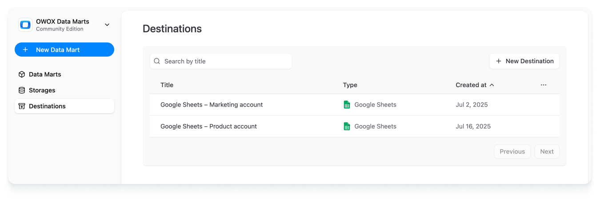

# Destination Management

**Destination** is an interface or application used by business users to access the data.  
Supported destinations include Google Sheets, Looker Studio, and OData-compatible tools like Excel, Tableau, and Power BI.  
Each **Data Mart** can be linked to multiple **Destinations**, allowing data to be consumed in various ways.

---

## Adding a New Destination

To configure a new **Destination**:

1. On the **Destinations** page, click **+ New Destination**.
2. Choose a storage type option on the **Destination Type** dropdown list:
    - [Google Sheets](supported-destinations/google-spreadsheets.md)
    - [Looker Studio](supported-destinations/looker-studio.md)
    - OData (Coming soon)

3. Complete the configuration fields specific to the selected **Destination Type**. Refer to the corresponding service configuration page for detailed instructions.
4. Click **Save** to apply the **Destination** configuration or **Cancel** to discard changes.

---

## Removing a Destination

To remove an existing **Destination** configuration:

1. Ensure all associated **Reports** referencing this **Destination** are deleted first:
   - Navigate to the **Data Marts** page and identify any Data Mart **Reports** using the **Destination**.
   - Delete each associated **Report** individually.
2. Go to the **Destinations** page via the main navigation pane.
3. Locate the **Destination** you want to delete in the table, click the item actions menu (represented by **...**), and click **Delete**.
4. Confirm the deletion to remove the **Destination**.

> ☝️ Attempting to delete a **Destination** with associated **Reports** will result in the error: "Cannot delete the destination because it is referenced by N existing report(s)".  
> Ensure all dependencies are removed before proceeding.

---

## Key Considerations

- Each **Report** requires a single **Destination** association.
- For additional guidance or troubleshooting, explore the supported **Destination** configuration pages or join the [OWOX Community](https://github.com/OWOX/owox-data-marts/discussions).
