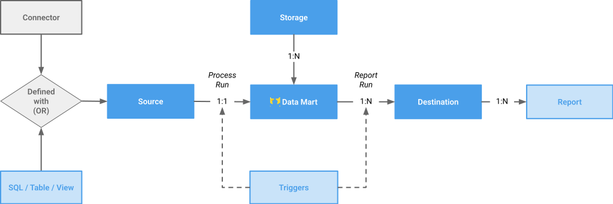

# Core Concepts

**OWOX Data Marts** is a solution developed by the OWOX team, drawing on over 20 years of experience in data analytics and business consulting. Its primary goal is to help organizations embrace self-service analytics by providing both control for data analysts and freedom for business users.

This guide will help you unlock the product’s full value and save time during implementation.

---
## Entities
### Data Mart

A **Data Mart** is the foundational entity in OWOX Data Marts. It can be defined in various ways, for example:

- With a **SQL query**
- By referencing an existing **table**
- Using a community **connector**
- etc

**Connector-defined** Data Marts import data from external **Sources** (e.g., Facebook Ads, Google Sheets) into a **Storage**.
All other types of Data Marts query data directly from the **Storage**.

> ☝️ **Data Marts** empower Data Analysts to control and hand off business-ready data.

---
### Source

**Source** is a service that holds data you want to manipulate—for example, Facebook Ads, Google Analytics, Salesforce, Google Sheets, Snowflake, etc. You can find the available connectors [here](https://docs.owox.com/#data-sources).

> ☝️ By managing a Data Mart’s **Sources**, a Data Analyst controls the origin of the data.

---
### Storage

**Storage** is a special kind of **Source** refers to your SQL-compatible data warehouse, such as:

- Google BigQuery
- AWS Athena
- Snowflake
- etc

Each project must have at least one **Storage**, as all your data is stored and processed in your **Storage**. You can configure multiple **Storages** in your project, but each **Data Mart** must be linked to exactly one **Storage**.

> ☝️ By specifying a Data Mart’s **Storage**, a Data Analyst ensures data ownership and controls where the data is stored and processed.

---
### Destination

A **Destination** is an interface or application used by business users to access the data. Supported destinations include:

- Google Sheets
- Looker Studio
- OData (compatible with Excel, Tableau, Power BI, etc)

Each **Data Mart** can be linked to multiple **Destinations**.

- All destinations except Google Sheets operate in **pull mode** — they query **Storage** when a user or tool requests the data.  
- Google Sheets uses **push mode** — data is exported from the **Data Mart** into a **Report** in Google Sheets via manual or scheduled runs.

> ☝️ **Destinations** allow Data Analysts to control and monitor which services business users consume data in.

---
### Report

A *Report* defines a specific sheet within a Google Sheets document where the Data Mart’s data is exported.
Different Google Sheets Reports of the same Data Mart may have different scheduled triggers.

---
### Trigger

Automation controls movement on a scheduled basis through **Triggers**.

Triggers initiate two types of runs:
- **Connector Runs** – Import data from a **Source** into **Storage**.  
- **Report Runs** – Push or pull a **Report's** data (stored in **Storage**) to a **Destination**.

> ☝️ **Triggers** allow Data Analysts to control data freshness and save time.
