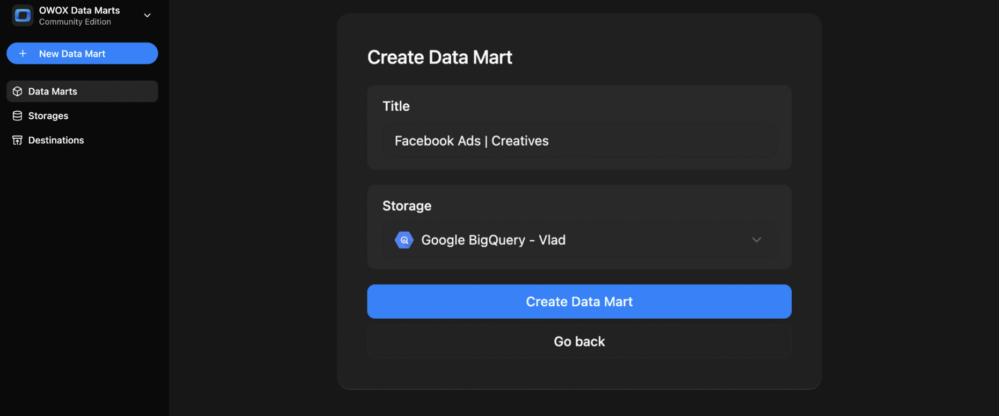
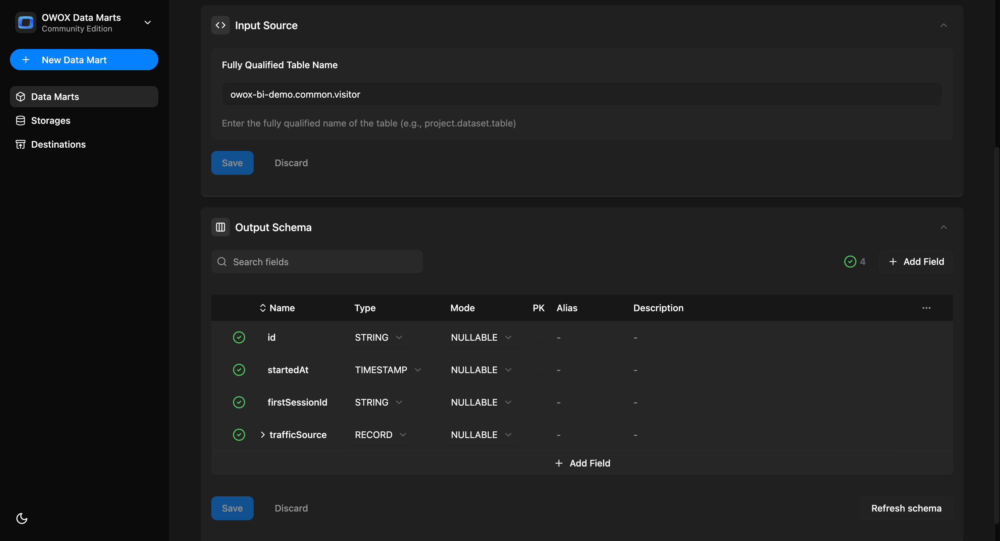

# Creating a Data Mart from a Table

Use this option when you want to define a Data Mart that directly references an existing table in your data warehouse without using `SELECT * FROM table`.

This is ideal when the table has already been prepared (e.g., cleaned, modeled, joined) and is ready for reporting or reuse.

## Step 1: Create a New Data Mart

- Click **+ New Data Mart**
- Give it a clear title, e.g. `Visitors`
- Select your **Data Storage** (BigQuery or Athena)
- Click **Create Data Mart**

## Step 2: Enter Table Details

In the **Input Source** panel:

- Set **Definition Type** to `Table`
- Add the **Fully Qualified Table Name** in the format:  
  `projectId.datasetId.tableId` (for BigQuery)
  `catalog.schema.table` (for Athena)  

Click **Save**

Once saved, the **Output Schema** will be generated automatically with:

- Field names
- Data types

You can then:

- Add **aliases** (business-friendly names)
- Write **descriptions** for each field
- Add a **description** to the Data Mart itself
- Specify **join keys**

Click **Publish Data Mart**

## Step 3: Add a Destination

You can export the results to:

- **Google Sheets** → Set up destination, choose refresh schedule, and filters
- **Looker Studio** (coming soon)
- **OData** for Excel, Power BI, Tableau (coming soon)

Each destination will reuse the same Data Mart — no need to duplicate logic. You can share the same logic across multiple tools.

To do this:

1. Under the **Destinations** section, click **+ Add report**
2. Give your report a name, e.g. `Website Visitors`
3. Select a destination
4. Create a new Google Sheets document (or use an existing one) and share it (Edit permissions) with your **Google Sheets Service Account**
5. Add a link to your document (and specify the tab) and click **Create new report**

You can now:

- Run report  
- Edit report  
- Open document  
- Delete report

## Step 4: Set Triggers

You can automate updates by setting a [Trigger](report-triggers.md) to refresh the data on a schedule.

Go to the **Triggers** tab → Click **+ Add Trigger**

- Choose **Trigger Type**: `Report Run`
- Set schedule:
  - **Daily** → Choose time and timezone
  - **Weekly** → Select days of the week, time, and timezone
  - **Monthly** → Select dates, time, and timezone
  - **Interval** → e.g., every 15 minutes
- Click **Create trigger**

You can also open the **Run History** tab to view execution logs, status, and timestamps.

## Related Pages

- [Scheduling Reports Updates →](report-triggers.md)
- [Adding More Report Destinations →](create-a-destination.md)
- [Create Connector-Based Data Mart →](create-connector-data-mart.md)
- [Create SQL-Based Data Mart →](create-sql-data-mart.md)
- [Create View-Based Data Mart →](create-view-data-mart.md)
- [Create Pattern-Based Data Mart →](create-pattern-data-mart.md)
