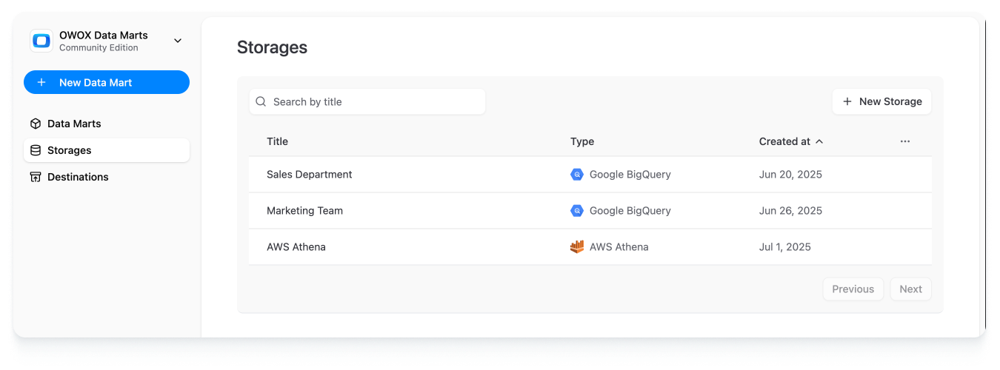

# Storage Management
Storages are specialized Data Sources that provide an SQL interface for querying and caching data.  
OWOX Data Marts does not retain your data, ensuring that data ownership, storage, and processing control remain with the Data Analyst.  
Each project requires at least one **Storage** to be configured to manage and process your data, though multiple **Storages** may be configured to meet specific data requirements.

---

## Adding a New Storage
To configure a new **Storage**:
1. On the **Storages** page, click **+ New Storage**.
2. Choose a storage type option on the **New Storage** modal window:
    - [Google BigQuery](supported-storages/google-bigquery.md)
    - [AWS Athena](supported-storages/aws-athena.md)
    - Snowflake (Coming soon)
    - Databricks (Coming soon)
    - AWS Redshift (Coming soon)
    - Azure Synapse (Coming soon)
3. Fill in the required configuration fields based on the selected Storage Type. Refer to the corresponding service configuration page for detailed setup instructions.
4. Click **Save** to apply the storage configuration or **Cancel** to defer configuration to a later time.

> ☝️ Upon selecting the **+ New Storage** button and specifying the desired storage type, a Storage entry is created. You can create **Data Mart** entities and model a data structure for your project prior to configuring the **Storage**.  
> Note that **Data Mart** cannot be validated or published until the associated **Storage** is fully configured.

---

## Removing a Storage
To remove an existing **Storage** configuration:
1. Ensure all associated **Data Marts** linked to this **Storage** are deleted first. To do this:
   - Navigate to the **Data Marts** page in the OWOX Data Marts web application.
   - Identify and select all Data Marts associated with the Storage you intend to remove.
   - Click the **Delete** button above the Data Marts table and confirm the deletion.
2. Go to the **Storages** page via the main navigation pane.
3. Locate the **Storage** you want to delete in the table, click the item actions menu (represented by **...**), and click **Delete**.
4. Confirm the deletion to remove the Storage.

> ☝️ Attempting to delete a **Storage** with associated Data Marts will result in the error: "Cannot delete the storage because it is referenced by existing data marts".  
> Ensure all dependencies are removed before proceeding.

---

## Key Considerations

- Each **Data Mart** requires a single **Storage** association. Verify your selection during **Data Mart** setup.
- For additional guidance or troubleshooting, explore the supported **Storage** configuration pages or join the [OWOX Community](https://github.com/OWOX/owox-data-marts/discussions).
